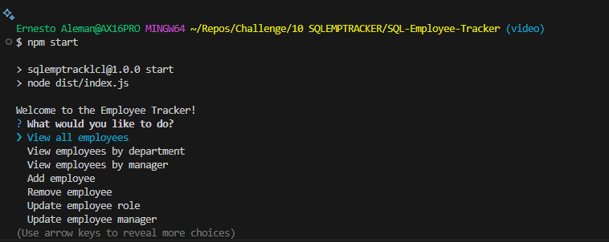

# SQL-Employee-Tracker


## Description 
This project utilizes SQL postgres database alongside inquirer for the command line interface. It's purpose is to generate an interactive interface for the user to manage employees, departments, roles with additional features such as updating role titles, salaries, and so on. 


## Table of Contents 
* [Description](#description)
* [Installation](#installation)
* [Technologies](#technologies)
* [License](#license)
* [Links](#links)
* [Questions](#questions)

## Installation
Ensure you have Postgres SQL installed. Once you have installed postgres, if needed, updated the .env.example to have your postgres pass in the DB_PASSWORD variable (placeholder present). Once you have your server going you can install dependencies and execute these commands at the root:

```bash
npm i
```

Login to PostgreSQL & enter password when prompted upon running the following:

```bash
psql -U <user_name>
```

Execute these commands once Postgre Shell is initiialized:

```bash
\i src/db/schema.sql
\i src/db/seed.sql
```

Lastly, execute:

```bash
npm run build
npm start
```

You should see this after "npm start": <br>
 <br>

## Technologies
* JavaScript
* TypeScript
* PostgreSQL
* Node.js

## License
This project is licensed under the MIT License

## Links
* [GitHub Repository](https://github.com/Bakenavva/SQL-Employee-Tracker)
* [Demo Video](https://drive.google.com/file/d/1Pv4RtcTY-5ilZx9uhk4nQSpXpwyym8fh/view?usp=sharing)

## Questions
Further questions can reach me via:
- GitHub: [Bakenavva](https://github.com/Bakenavva)
- Email:  ernestoaleman00@gmail.com
